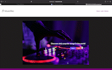

# Music Rec

## Brief Summary
* A cloud native application that allows user to sign-up, sign-in, add and delete daily top songs.

## Instructions
* Frontend: NextJS
* Backend: Golang
* Database: CockroachDB (postgres)
* DebOps: Kubernetes, Terraform

  